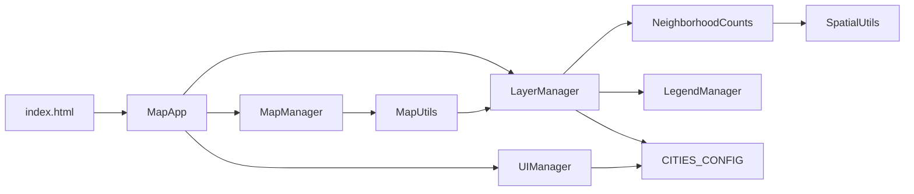

# Mapa Interactivo del Chaco

Static Leaflet app for exploring infrastructure, census, electoral, and neighborhood layers in three Chaco localities:

| Key | UI label | Config name | Data folder |
|-----|----------|-------------|-------------|
| `sp` | Presidencia Roque S. Peña | Presidencia Roque Sáenz Peña | [`datos/SP/`](datos/SP/README.md) |
| `gr` | Gran Resistencia | Gran Resistencia | [`datos/gran_Resis/`](datos/gran_Resis/README.md) |
| `va` | Villa Ángela | Villa Ángela | [`datos/villa_angela/`](datos/villa_angela/README.md) |

Default city on load is **`sp`**.

## How to run

No build step and no backend. Serve the repo root over HTTP (GeoJSON `fetch` fails from `file://`).

```bash
# from repo root
python3 -m http.server 8080
# open http://localhost:8080/
```

Any static host works (GitHub Pages, nginx, etc.). Cache-bust query strings on script tags (`?v=…`) are in [`index.html`](index.md).

## Architecture

Plain script tags (not ES modules). Load order matters:

```
config.js → map.js → spatial.js → legends.js → layers.js → ui.js → app.js
```



| Module | Role |
|--------|------|
| [`js/config.js`](js/config.md) | `CITIES_CONFIG`, `COLOR_PALETTES`, `TRANSLATIONS` |
| [`js/map.js`](js/map.md) | `MapManager` (Leaflet map + city view) + `MapUtils` (styles + popups) |
| [`js/spatial.js`](js/spatial.md) | `SpatialUtils` + `NeighborhoodCounts` |
| [`js/legends.js`](js/legends.md) | `LegendManager` (legend HTML + last-visible stack) |
| [`js/layers.js`](js/layers.md) | `LayerManager` — fetch / cache / show / hide lifecycle |
| [`js/ui.js`](js/ui.md) | `UIManager` — Capas del Mapa panel + city switcher |
| [`js/app.js`](js/app.md) | `MapApp` wiring + `window.layerManager` |

`layers.js` was split without behavior change. Legend HTML lives in `LegendManager`; point-in-polygon counting lives in `NeighborhoodCounts`. Popups and polygon/marker styles stay in `MapUtils` and call `window.layerManager`.

## Data flow

1. User checks a layer in **Capas del Mapa**.
2. `UIManager.handleLayerToggle` → `LayerManager.loadLayer(name, config)`.
3. `fetchGeoJSON` loads `CITIES_CONFIG[city].dataPath + config.file` (keyed cache `city::file`; in-flight dedupe). Optional `joinFile` merge (Villa Ángela **Población por Radio**).
4. Create a Leaflet layer:
   - `type: 'clustered'` → marker cluster (**Mesas por Escuela** / **Electores por Escuela**)
   - name `'Escuelas'` → colored `L.circleMarker`s
   - else → `L.geoJSON` (canvas renderer if `heavy: true`)
5. `addLayerToMap` adds it, then `LegendManager.push` + `update`.
6. Click feature → `MapUtils.buildPopupContent` (evaluated on open so Barrios counts stay fresh).

Heavy layers (`Calles`, `Manzanas`, `Edificaciones`) skip idle prefetch and use `featureCount` for the badge without parsing GeoJSON.

## City switcher and `layerGeneration`

Header buttons `data-city="sp|gr|va"` call `UIManager.switchCity`:

1. `LayerManager.clearAllLayers()` — increments `layerGeneration`, drops Leaflet layers, empties `loadedLayers` / `geojsonCache` / in-flight maps, resets counts, clears legend.
2. `MapManager.switchToCity` — `setView` to that city’s `center`/`zoom`.
3. Recreate checkboxes; update `.logo h1` to `Mapa Interactivo - ${cityConfig.name}`.

In-flight `fetch`/`loadLayer` whose captured generation no longer matches throws `'Layer load cancelled'`. The UI ignores that error if the checkbox or city already changed.

## Neighborhood counting (Barrios popups)

When **Barrios** is shown, `loadCountingLayers` prefetches GeoJSON for:

- **Escuelas**
- **Comisarias** (SP only)
- **Manzanas_Puntos** (SP only, `hidden: true` — not listed in the panel)

`NeighborhoodCounts.apply()` writes `schoolCount`, `policeCount`, `blockCount` onto each barrio feature. Popups show a row only if `hasCountingDataset(name)` is true (config exists **and** GeoJSON is cached).

| City | Barrios | Escuelas | Comisarias | Manzanas_Puntos |
|------|---------|----------|------------|-----------------|
| `sp` | yes | catalog `escuelas_sp_completo.geojson` | yes | yes (hidden) |
| `gr` | yes | enriched mesas file | no | no |
| `va` | **no layer** | enriched mesas file | no | no |

`MapUtils.getNeighborhoodKey` disambiguates polygons (`nombre`/`Barrio` + optional `Municipio` + `id`). Overlapping polygons: last barrio in the FeatureCollection wins.

## UI layout

- **Header** — logo + city selector (`sp` / `gr` / `va`)
- **`#map`** — Leaflet; base maps OSM / Satelital / Topográfico; zoom top-right
- **Capas del Mapa** (`#controls-panel`) — grouped checkboxes + feature counts
- **Legend** — Leaflet control bottom-right, last visible thematic layer
- **Popups** — dark `.custom-popup` cards
- **`#loading`** — spinner until `MapManager.init` finishes

Layer groups in config: **Infraestructura**, **Divisiones**, **Servicios**, **Electoral**, **Censo**.

## Docs tree

This folder mirrors the repo (no invented app folders):

- [`index.md`](index.md) — `index.html`
- [`css/`](css/README.md) — styles
- [`js/`](js/README.md) — application modules
- [`datos/`](datos/README.md) — GeoJSON per city
- [`scripts/`](scripts/README.md) — school enrichment
- [`tmp-prod-screenshots/`](tmp-prod-screenshots/README.md) — prod smoke reports (not runtime)
